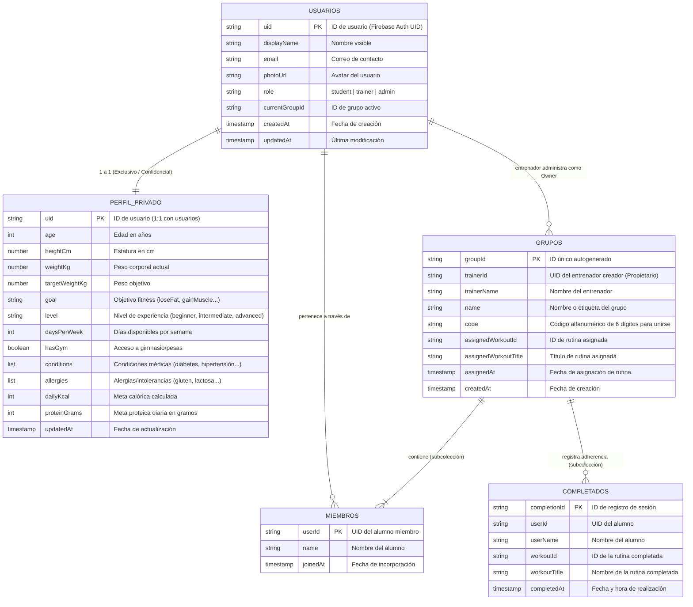

# Especificación de Base de Datos Cloud Firestore — VigoriaFit
**Proyecto de Título — Ingeniería en Informática, INACAP**  
**Actividad 3:** Definición de Primeras Colecciones (`usuarios`, `perfil_privado` y `grupos`), Campos y Propietarios.

---

## 1. Introducción y Justificación Arquitectónica

VigoriaFit utiliza **Google Cloud Firestore** como base de datos NoSQL documental orientada a documentos y colecciones en tiempo real. 

### Principio de Segregación de Datos y Privacidad (Privacy by Design)
En aplicaciones de salud y fitness que recopilan datos médicos (lesiones, enfermedades crónicas, alergias alimentarias) y métricas antropométricas (peso, estatura, IMC):
1. **Perfil Público (`usuarios`)**: Permite la interacción comunitaria, visualización de nombres de alumnos por el entrenador y membresía en grupos sin vulnerar datos privados.
2. **Perfil Privado (`perfil_privado` / `usuarios/{uid}/privado`)**: Almacena información sensible protegida bajo estrictas reglas de autorización. Solo el propio usuario tiene acceso de lectura/escritura (cumplimiento de estándares de protección de datos como GDPR y Ley N° 19.628 de Protección de la Vida Privada).
3. **Grupos (`grupos`)**: Estructura colaborativa administrada por un entrenador (Owner), con subcolecciones para miembros inscritos y registros de adherencia deportiva en tiempo real.

---

## 2. Diagrama de Estructura de Colecciones



---

## 3. Especificación Detallada de Colecciones

### 3.1. Colección: `usuarios` (Perfil Público)
* **Ruta en Firestore**: `/usuarios/{userId}`
* **Finalidad**: Identidad base del usuario en la plataforma, visible para miembros de su mismo grupo y para el entrenador.
* **Propietario (Owner)**: El usuario autenticado cuyo `request.auth.uid == userId`.

| Campo | Tipo | Requerido | Descripción | Restricciones / Validación |
| :--- | :--- | :---: | :--- | :--- |
| `uid` | `String` | Sí | Identificador único de Firebase Authentication | Coincide con el UID del documento. |
| `displayName` | `String` | Sí | Nombre o alias que se muestra en la interfaz y grupos | 2 a 60 caracteres. |
| `email` | `String` | Sí | Correo electrónico de la cuenta | Formato válido de email. |
| `photoUrl` | `String` | No | URL pública del avatar o foto de perfil | URL HTTPS válida o cadena vacía. |
| `role` | `String` | Sí | Rol en el sistema: `'student'`, `'trainer'` o `'admin'` | Valor por defecto: `'student'`. |
| `currentGroupId` | `String` | No | ID del grupo al que pertenece actualmente | Referencia a `/grupos/{groupId}` o `null`. |
| `currentGroupCode` | `String` | No | Código de 6 dígitos del grupo actual | 6 dígitos numéricos o `null`. |
| `createdAt` | `Timestamp` | Sí | Fecha de registro inicial en el sistema | Generado con `serverTimestamp()`. |
| `updatedAt` | `Timestamp` | Sí | Fecha de última actualización de datos básicos | Generado con `serverTimestamp()`. |

#### Ejemplo de Documento JSON (`/usuarios/usr_abc123`):
```json
{
  "uid": "usr_abc123",
  "displayName": "Constanza Silva",
  "email": "csilva@inacapmail.cl",
  "photoUrl": "https://lh3.googleusercontent.com/a/usr_abc123",
  "role": "student",
  "currentGroupId": "grp_fuerza_01",
  "currentGroupCode": "849201",
  "createdAt": "2026-03-10T14:30:00Z",
  "updatedAt": "2026-10-05T20:15:00Z"
}
```

---

### 3.2. Colección: `perfil_privado` (Datos Antropométricos y de Salud)
* **Ruta en Firestore**: `/usuarios/{userId}/perfil_privado/datos` (Subcolección privada) o `/perfiles_privados/{userId}`
* **Finalidad**: Contiene las métricas de salud, objetivos, condiciones clínicas preexistentes y restricciones nutricionales necesarias para que el motor de recomendaciones y el coach de IA personalicen la experiencia sin exponer información médica a otros usuarios.
* **Propietario (Owner)**: Exclusivamente el usuario autenticado (`request.auth.uid == userId`). Ningún otro usuario ni alumno tiene permiso de lectura o escritura.

| Campo | Tipo | Requerido | Descripción | Restricciones / Validación |
| :--- | :--- | :---: | :--- | :--- |
| `userId` | `String` | Sí | Identificador del usuario propietario | Debe coincidir con `request.auth.uid`. |
| `age` | `Number (int)` | Sí | Edad del usuario en años | Rango permitido: 12 a 100 años. |
| `heightCm` | `Number (double)` | Sí | Altura expresada en centímetros | Rango permitido: 100.0 a 240.0 cm. |
| `weightKg` | `Number (double)` | Sí | Peso actual expresado en kilogramos | Rango permitido: 30.0 a 300.0 kg. |
| `targetWeightKg` | `Number (double)` | Sí | Peso corporal meta fijado por el usuario | Rango permitido: 30.0 a 300.0 kg. |
| `goal` | `String` | Sí | Objetivo de acondicionamiento físico | Valores: `'loseFat'`, `'gainMuscle'`, `'maintain'`, `'health'`. |
| `level` | `String` | Sí | Nivel de experiencia deportiva | Valores: `'beginner'`, `'intermediate'`, `'advanced'`. |
| `daysPerWeek` | `Number (int)` | Sí | Frecuencia de entrenamientos por semana | Rango: 1 a 7 días. |
| `hasGym` | `Boolean` | Sí | Indica si dispone de acceso a gimnasio/máquinas | `true` o `false`. |
| `conditions` | `Array<String>` | Sí | Lista de condiciones médicas o patologías | Valores: `'diabetes'`, `'prediabetes'`, `'hipertension'`, `'colesterolAlto'`, `'hipotiroidismo'`, `'gastritisReflujo'`, `'enfermedadRenal'`, `'lesionRodilla'`, `'lesionEspalda'`. |
| `allergies` | `Array<String>` | Sí | Intolerancias o alergias alimentarias | Valores: `'lactosa'`, `'gluten'`, `'frutosSecos'`, `'mariscos'`, `'huevo'`, `'soya'`. |
| `dailyKcal` | `Number (int)` | No | Gasto calórico diario estimado (fórmula Mifflin-St Jeor) | Valor entero positivo (> 500 kcal). |
| `proteinGrams` | `Number (int)` | No | Meta de consumo de proteína diaria en gramos | Valor entero positivo (> 20 g). |
| `waterGoalGlasses` | `Number (int)` | No | Meta diaria de vasos de agua (250 ml c/u) | Valor por defecto: 8 (~2 Litros). |
| `updatedAt` | `Timestamp` | Sí | Fecha de la última edición del perfil médico/fitness | Generado con `serverTimestamp()`. |

#### Ejemplo de Documento JSON (`/usuarios/usr_abc123/perfil_privado/datos`):
```json
{
  "userId": "usr_abc123",
  "age": 22,
  "heightCm": 172.5,
  "weightKg": 68.0,
  "targetWeightKg": 65.0,
  "goal": "loseFat",
  "level": "intermediate",
  "daysPerWeek": 4,
  "hasGym": true,
  "conditions": [
    "resistencia_insulina",
    "lesionRodilla"
  ],
  "allergies": [
    "lactosa"
  ],
  "dailyKcal": 1850,
  "proteinGrams": 122,
  "waterGoalGlasses": 8,
  "updatedAt": "2026-10-05T21:40:00Z"
}
```

---

### 3.3. Colección: `grupos` (Gestión de Entrenador y Equipos)
* **Ruta en Firestore**: `/grupos/{groupId}`
* **Finalidad**: Coordinación de grupos de entrenamiento guiados por un entrenador (trainer). Permite la asignación masiva de rutinas y seguimiento de adherencia.
* **Propietario (Owner)**: El entrenador que creó el grupo (`request.auth.uid == resource.data.trainerId`).

| Campo | Tipo | Requerido | Descripción | Restricciones / Validación |
| :--- | :--- | :---: | :--- | :--- |
| `groupId` | `String` | Sí | ID autogenerado del documento de grupo | Hash de Firestore o autoincremental. |
| `trainerId` | `String` | Sí | UID del entrenador creador y administrador | Debe coincidir con `request.auth.uid`. |
| `trainerName` | `String` | Sí | Nombre o alias del entrenador | 2 a 60 caracteres. |
| `name` | `String` | No | Nombre descriptivo del grupo de entrenamiento | Ej. "Fuerza Mañana - Sede Central". |
| `code` | `String` | Sí | Código de acceso para que los alumnos se unan | Exactamente 6 dígitos numéricos únicos. |
| `assignedWorkoutId` | `String` | No | ID de la rutina asignada desde el catálogo | Ej. `'fullbody_a'`, `'upper_b'` o `null`. |
| `assignedWorkoutTitle`| `String` | No | Título legible de la rutina asignada | Ej. "Full Body Funcional A" o `null`. |
| `assignedAt` | `Timestamp` | No | Momento en que el entrenador asignó la rutina | `Timestamp` o `null`. |
| `createdAt` | `Timestamp` | Sí | Momento de creación del grupo | Generado con `serverTimestamp()`. |

#### Subcolección 3.3.1: `grupos/{groupId}/members` (Alumnos inscritos)
* **Ruta**: `/grupos/{groupId}/members/{userId}`
* **Propietario del Registro**: El alumno (`request.auth.uid == userId`) al unirse, y el entrenador (`trainerId`) como administrador general del grupo.

| Campo | Tipo | Requerido | Descripción |
| :--- | :--- | :---: | :--- |
| `name` | `String` | Sí | Nombre del alumno mostrado al entrenador y al grupo. |
| `joinedAt` | `Timestamp` | Sí | Fecha/hora en que el alumno ingresó el código de 6 dígitos. |

#### Subcolección 3.3.2: `grupos/{groupId}/completions` (Registro de Adherencia)
* **Ruta**: `/grupos/{groupId}/completions/{completionId}`
* **Propietario del Registro**: El alumno que completó la rutina (`request.auth.uid == resource.data.userId`).

| Campo | Tipo | Requerido | Descripción |
| :--- | :--- | :---: | :--- |
| `userId` | `String` | Sí | UID del alumno que completó la rutina. |
| `userName` | `String` | Sí | Nombre del alumno. |
| `workoutId` | `String` | Sí | ID de la rutina completada. |
| `workoutTitle` | `String` | Sí | Título de la rutina completada. |
| `completedAt` | `Timestamp` | Sí | Fecha/hora exacta en que se marcó como terminada. |

#### Ejemplo de Documento JSON (`/grupos/grp_fuerza_01`):
```json
{
  "trainerId": "trainer_miguel99",
  "trainerName": "Prof. Miguel González",
  "name": "Acondicionamiento Físico Nivel 1",
  "code": "849201",
  "assignedWorkoutId": "fullbody_a",
  "assignedWorkoutTitle": "Full Body Principiante A",
  "assignedAt": "2026-10-04T09:00:00Z",
  "createdAt": "2026-10-01T12:00:00Z"
}
```

---

## 4. Matriz de Roles, Propietarios y Permisos (CRUD)

| Colección / Ruta | Propietario (Owner) | Create | Read (Get/List) | Update | Delete |
| :--- | :--- | :--- | :--- | :--- | :--- |
| `/usuarios/{userId}` | El Usuario (`userId`) | Usuario autenticado | Cualquier usuario autenticado | Solo el propietario (`userId`) | Solo el propietario / Admin |
| `/usuarios/{userId}/perfil_privado/*` | El Usuario (`userId`) | Solo el propietario (`userId`) | **Solo el propietario** (`userId`) | Solo el propietario (`userId`) | Solo el propietario |
| `/grupos/{groupId}` | Entrenador (`trainerId`) | Entrenador autenticado | Entrenador del grupo y Alumnos con el código | Solo el Entrenador propietario | Solo el Entrenador propietario |
| `/grupos/{groupId}/members/{userId}` | El Alumno (`userId`) | El Alumno con código válido | Entrenador y miembros del grupo | Solo el Alumno | Alumno (salir) o Entrenador (expulsar) |
| `/grupos/{groupId}/completions/{id}` | El Alumno (`userId`) | Alumno al completar sesión | Entrenador (para métricas) y Alumno | Inmutable (No editable) | Solo el Alumno o Entrenador |

---

## 5. Reglas de Seguridad en Cloud Firestore (`firestore.rules`)

A continuación se presenta la implementación de las reglas de seguridad basadas en esta definición:

```javascript
rules_version = '2';
service cloud.firestore {
  match /databases/{database}/documents {

    // Funciones auxiliares de autenticación y autorización
    function isAuthenticated() {
      return request.auth != null;
    }

    function isOwner(userId) {
      return isAuthenticated() && request.auth.uid == userId;
    }

    // 1. Colección USUARIOS (Perfil Público)
    match /usuarios/{userId} {
      allow read: if isAuthenticated();
      allow create: if isOwner(userId);
      allow update: if isOwner(userId);
      allow delete: if isOwner(userId);

      // 2. Subcolección PERFIL PRIVADO (Datos médicos y antropométricos)
      match /perfil_privado/{document=**} {
        allow read, write: if isOwner(userId);
      }
    }

    // 3. Colección GRUPOS (Entrenador y Equipos)
    match /grupos/{groupId} {
      allow read: if isAuthenticated();
      allow create: if isAuthenticated() && request.resource.data.trainerId == request.auth.uid;
      allow update, delete: if isAuthenticated() && resource.data.trainerId == request.auth.uid;

      // Subcolección de Miembros
      match /members/{memberId} {
        allow read: if isAuthenticated();
        allow create, update: if isAuthenticated() && request.auth.uid == memberId;
        allow delete: if isAuthenticated() && (
          request.auth.uid == memberId || 
          get(/databases/$(database)/documents/grupos/$(groupId)).data.trainerId == request.auth.uid
        );
      }

      // Subcolección de Completados / Adherencia
      match /completions/{completionId} {
        allow read: if isAuthenticated();
        allow create: if isAuthenticated() && request.resource.data.userId == request.auth.uid;
        allow update, delete: if isAuthenticated() && (
          resource.data.userId == request.auth.uid ||
          get(/databases/$(database)/documents/grupos/$(groupId)).data.trainerId == request.auth.uid
        );
      }
    }
  }
}
```

---

## 6. Conclusión y Próximos Pasos

La arquitectura definida cumple con:
1. **Seguridad y Confidencialidad**: Aislamiento estricto de condiciones de salud y alergias en `perfil_privado`.
2. **Escalabilidad**: Las consultas de grupos no descargan todo el perfil privado de los alumnos, ahorrando lecturas y ancho de banda en Firestore.
3. **Consistencia con la Aplicación Móvil**: Alineado con `Profile` (`lib/models/profile.dart`), `TrainerService` (`lib/services/trainer_service.dart`) y `AppStore` (`lib/services/store.dart`).
